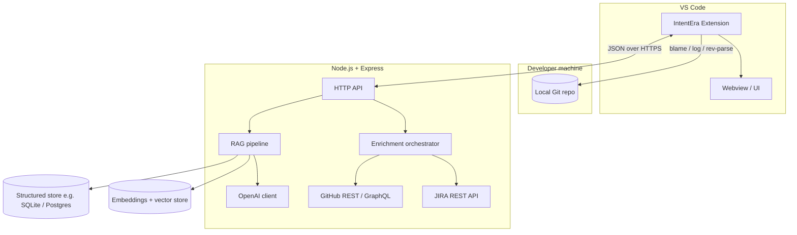
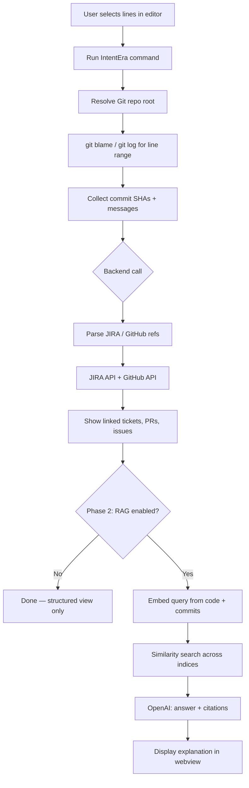
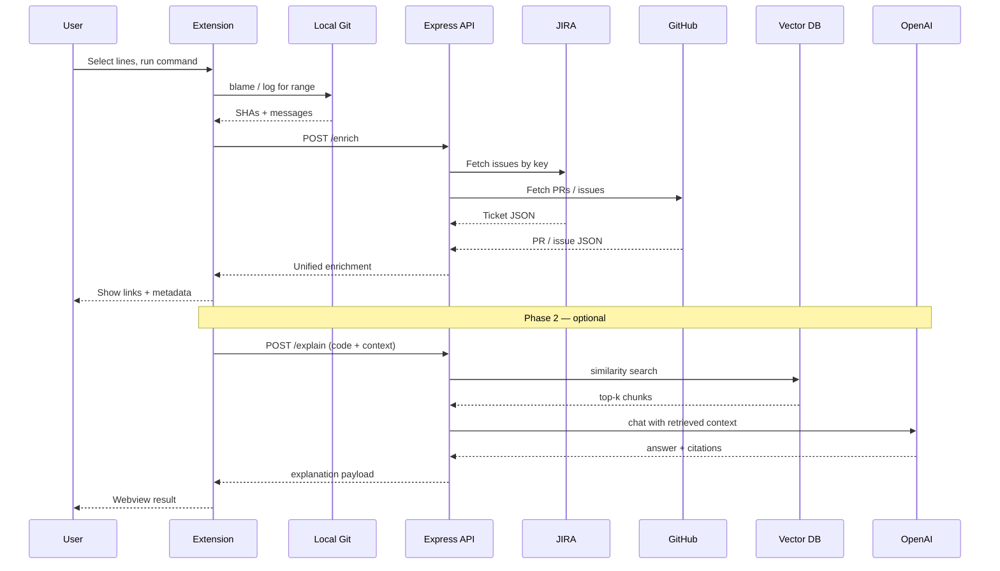

# IntentEra

IntentEra is a **VS Code extension** backed by a **Node.js (Express)** service. It connects **local Git history for selected lines** in a file with **JIRA tickets**, **GitHub pull requests**, and **GitHub issues**, then (in a later phase) uses **RAG** and **OpenAI** to retrieve similar past work and explain **why** a piece of code exists.

---

## Goals

| Capability | Description |
|------------|-------------|
| Line-scoped history | Full commit history relevant to the **selected line range** in the current file, using local Git on the machine. |
| JIRA | Fetch ticket metadata and bodies via **JIRA REST API** (keys parsed from commits/PRs or explicit lookup). |
| GitHub | Fetch **pull requests** and **issues** linked to commits, branches, or references in messages. |
| RAG (planned) | Chunk and embed JIRA issues, PRs, and GitHub issues; store vectors for similarity search. |
| “Why” explanations (planned) | Given selected code + commits + retrieval results, call **OpenAI** to produce an explanation with **traceable sources** (ticket URLs, PR numbers, issue links). |

---

## System architecture

High-level components and how they interact. Secrets (tokens, API keys) stay on the **server** or in local env—not baked into the extension bundle.

### Component responsibilities

- **Extension** — Captures editor selection (file path, start/end lines), resolves repository root, runs or requests Git operations, calls the backend for JIRA/GitHub/RAG/LLM, renders results in a webview or panel.
- **Express API** — Single place for credentials; implements routes for enrichment, (optional) server-side Git, ingestion, retrieval, and chat/explain endpoints.
- **Enrichment** — Maps commit SHAs and messages to JIRA keys (`PROJ-123`), GitHub PR/issue references (`#42`, `owner/repo#42`), then fetches normalized metadata.
- **RAG pipeline** — Chunk text, embed via OpenAI, upsert into a vector index; hybrid search with metadata filters (repo, source type, date).
- **OpenAI** — Embeddings for retrieval; chat/completions for synthesized “why” answers with citation instructions.

---

## End-to-end flow (user journey)

---

## Phased implementation flow (detailed)

### Phase A — Local history (no cloud)

1. User selects a **contiguous line range** in a tracked file.
2. Extension runs `git rev-parse --show-toplevel` to find the repo root (and validates the file is inside it).
3. Extension runs **`git blame -L start,end -- path`** to attribute each line to a commit.
4. Optionally runs **`git log -L start,end:path`** to list commits that historically touched those lines (richer than blame alone).
5. Output is normalized to a list of objects: `{ sha, author, date, subject, body?, lineRange }`.
6. UI shows a **timeline or list** of commits for that selection.

**Design choice:** Run Git **inside the extension** (typical) vs. send line info to the server and run Git there (requires the same filesystem or a clone on the server).

### Phase B — Link commits to JIRA and GitHub

1. From commit messages (and PR titles if already known), extract:
   - **JIRA keys** — regex such as `[A-Z][A-Z0-9]+-\d+`.
   - **GitHub** — `#123`, `fixes #123`, `owner/repo#123`, or full URLs.
2. **Deduplicate** IDs, then batch-fetch:
   - JIRA: issue fields (summary, description, status, assignee, links).
   - GitHub: PRs and issues via REST (and optionally GraphQL for comments).
3. **Associate SHAs to PRs** when not obvious: e.g. GitHub API to list PRs containing a commit (`/repos/{owner}/{repo}/commits/{sha}/pulls` where supported), or search by merge commit.
4. Return a **unified enrichment payload** for the extension to render (cards with links).

### Phase C — Express service shell

1. **Environment:** `GITHUB_TOKEN`, JIRA base URL + credentials, `OPENAI_API_KEY`, optional DB URL.
2. **Routes (illustrative):**
   - `GET /health` — liveness.
   - `POST /enrich` — body: `{ owner?, repo?, shas[], messages[] }` → linked JIRA/GitHub entities.
   - Later: `POST /ingest`, `POST /query`, `POST /explain`.
3. **Cross-cutting:** rate limiting, HTTP caching for stable resources, structured logging.

### Phase D — RAG ingestion and retrieval

1. **Sources:** JIRA descriptions/comments, GitHub issue and PR bodies, review comments (trimmed), optionally commit messages (diffs are often noisy for embedding—use sparingly or summarize first).
2. **Chunking:** fixed token windows with overlap, or section-aware splits for markdown.
3. **Embedding:** OpenAI embedding model; store with metadata `{ sourceType, externalId, url, repo, updatedAt }`.
4. **Sync:** on-demand per repo plus periodic refresh; **idempotent** upserts by external id.
5. **Query:** build a text query from **selected code** + **path** + **recent commit subjects**; retrieve top-k per source or one merged index with filters.

### Phase E — “Why” explanation (OpenAI)

1. **Inputs:** selection text, optional surrounding context, commit list, retrieved chunks with titles/URLs.
2. **Prompting:** require **citations** to ticket/PR/issue links; instruct the model to state **low confidence** when evidence is thin.
3. **Output:** short explanation + bullet list of **supporting references** for the user to open in browser.

---

## Data flow (enrichment + optional RAG)

---

## Tech stack (planned)

| Layer | Technology |
|-------|------------|
| Extension | VS Code Extension API, TypeScript |
| Backend | Node.js, Express |
| AI | OpenAI API (embeddings + chat) |
| Integrations | JIRA REST, GitHub REST/GraphQL |
| Storage | TBD — e.g. SQLite + local vector store, or Postgres + pgvector |

---

## Repository layout (to be filled as code lands)

As you add packages (`extension/`, `server/`, etc.), document the actual folders here so newcomers can navigate quickly.

---

## License

TBD.
