# IntentEra — Architecture

> A Lambda-based RAG (Retrieval-Augmented Generation) system that ingests data
> from **Jira/Confluence** and **GitHub** into **MongoDB Atlas Vector Search**,
> and exposes a query API for downstream LLM applications.

This document is the **source of truth** for how the system is wired,
how data flows through it, and why each design choice was made. Each
section pairs an explanation with a Mermaid diagram that you can render
directly in GitHub, VS Code, Cursor, or any Markdown previewer that
supports Mermaid.

---

## Table of Contents

1. [System overview (10,000-ft view)](#1-system-overview-10000-ft-view)
2. [Multi-source design](#2-multi-source-design-jira--github)
3. [Module map and project structure](#3-module-map-and-project-structure)
4. [Configuration and secrets loading](#4-configuration-and-secrets-loading)
5. [Dependency wiring (cold vs warm start)](#5-dependency-wiring-cold-vs-warm-start)
6. [Ingestion lifecycle — Jira](#6-ingestion-lifecycle--jira)
7. [Ingestion lifecycle — GitHub](#7-ingestion-lifecycle--github)
8. [Full vs incremental sync](#8-full-vs-incremental-sync)
9. [Redis sync state and locking](#9-redis-sync-state-and-locking)
10. [Chunking strategy](#10-chunking-strategy)
11. [Vector store layout (MongoDB Atlas)](#11-vector-store-layout-mongodb-atlas)
12. [Retrieval lifecycle](#12-retrieval-lifecycle)
13. [Failure handling and retries](#13-failure-handling-and-retries)
14. [AWS deployment topology](#14-aws-deployment-topology)
15. [Local development flow](#15-local-development-flow)
16. [Tradeoffs and future work](#16-tradeoffs-and-future-work)

---

## 1. System overview (10,000-ft view)

The system is composed of **two AWS Lambda functions**, **two backing
services** (MongoDB Atlas + Redis), and **upstream data sources** (Jira,
Confluence, GitHub). The same source code is invoked locally via a CLI
runner so dev and prod behave identically.

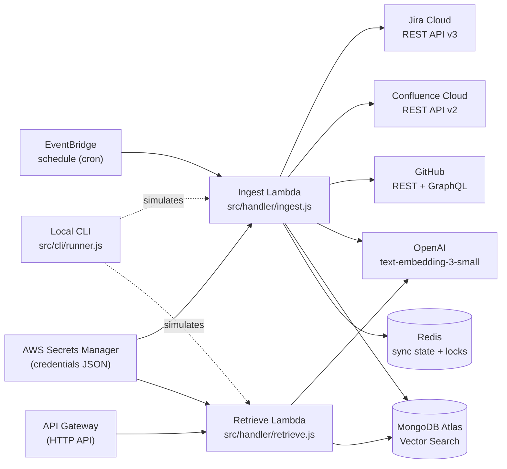

**Two Lambdas, not one**, because ingestion and retrieval have very
different operational profiles: ingestion is bursty, time-bounded, and
heavy on outbound HTTP; retrieval is latency-sensitive, frequent, and
small. Splitting them lets us tune memory, timeout, and concurrency
independently.

---

## 2. Multi-source design (Jira + GitHub)

Each upstream data source has its **own ingestion pipeline, its own
Mongo collection with its own vector index, and its own Redis state
key**. They share a config loader, a logger, an embedder, and a
`MongoVectorStore` class — but the *instances* are separate so a failure
on one side cannot stall the other.

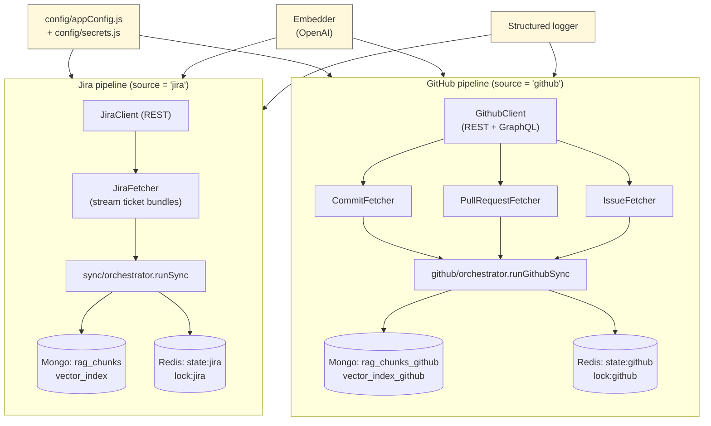

The single Lambda decides which pipeline to run based on the event
payload (`source: "jira" | "github"`) or the `SYNC_SOURCE` env var.
Retrieval can target one pipeline or **both** (results are
score-merged).

---

## 3. Module map and project structure

```
IntentEra/
├── package.json
├── .env.example
├── architecture.md                # ← you are here
├── config/
│   ├── appConfig.js               # validated, typed config from process.env
│   └── secrets.js                 # AWS Secrets Manager → process.env loader
├── src/
│   ├── handler/
│   │   ├── ingest.js              # Lambda entry point — ingestion
│   │   └── retrieve.js            # Lambda entry point — retrieval
│   ├── cli/
│   │   └── runner.js              # Local CLI that mimics Lambda invocations
│   ├── jira/
│   │   ├── client.js              # Jira REST wrapper (axios + pagination)
│   │   └── fetcher.js             # Streams full ticket "bundles"
│   ├── confluence/
│   │   └── client.js              # Confluence REST wrapper
│   ├── attachments/
│   │   └── parser.js              # PDF / DOCX / TXT / HTML extractors
│   ├── normalization/
│   │   └── normalizer.js          # Raw Jira JSON → unified ticket shape
│   ├── chunking/
│   │   └── chunker.js             # Semantic-aware chunking per source type
│   ├── github/
│   │   ├── client.js              # GitHub REST + GraphQL wrapper
│   │   ├── branches.js            # Active-branch resolution
│   │   ├── orchestrator.js        # GitHub equivalent of sync/orchestrator
│   │   ├── commits/{fetcher,normalizer,chunker}.js
│   │   ├── pullRequests/{fetcher,normalizer,chunker}.js
│   │   └── issues/{fetcher,normalizer,chunker}.js
│   ├── sync/
│   │   └── orchestrator.js        # Jira ingestion orchestrator
│   ├── state/
│   │   └── redisState.js          # Per-source checkpoint + lock
│   ├── embeddings/
│   │   └── embedder.js            # OpenAI embeddings (batched, retried)
│   ├── vectorStore/
│   │   └── mongoStore.js          # Atlas Vector Search wrapper
│   ├── retrieval/
│   │   └── queryHandler.js        # Source routing + score-sorted merge
│   └── utils/
│       ├── wiring.js              # Dependency factory (cached singletons)
│       ├── logger.js              # Structured JSON logger
│       └── retry.js               # Exponential backoff helper
└── docs/                          # Beginner-friendly setup guides
```

The **boundary rule** is important: anything that talks to the network
lives in a `client.js` or `*Store.js`/`*State.js`. Every other module is
pure-ish (input → output) and trivial to unit-test.

---

## 4. Configuration and secrets loading

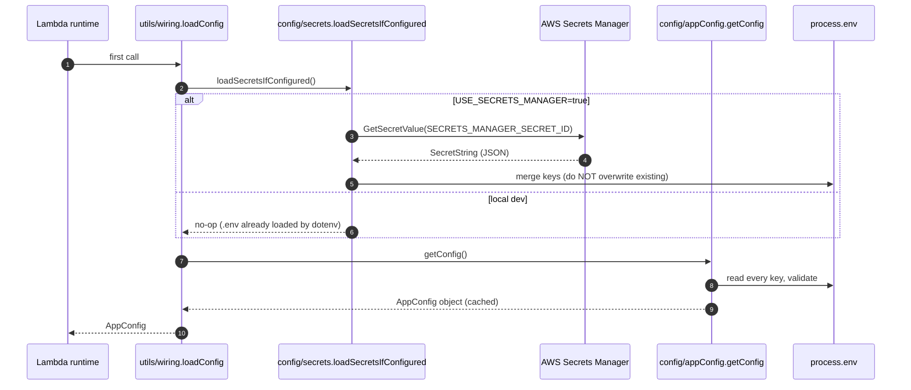

Key points:

- **`.env` and Secrets Manager are interchangeable**. The same keys live
  in both; the loader just merges them into `process.env`.
- **Lambda env vars win** over Secrets Manager (we only fill blanks).
  This lets operators pin a value via the Lambda console for emergency
  overrides without rotating the secret.
- **Validation is loud, not silent**. Missing required keys throw at
  config load time, so a bad deployment fails on its first invocation.
- **Credentials for the SDK** are **not** taken from a profile in
  Lambda. The Secrets Manager client uses the **default credential
  provider chain**, which automatically picks up the Lambda execution
  role.

---

## 5. Dependency wiring (cold vs warm start)

`utils/wiring.js` is the only place that constructs concrete clients.
It uses **module-level singletons** so the second invocation in a warm
container reuses Mongo/Redis connections, OpenAI clients, etc.

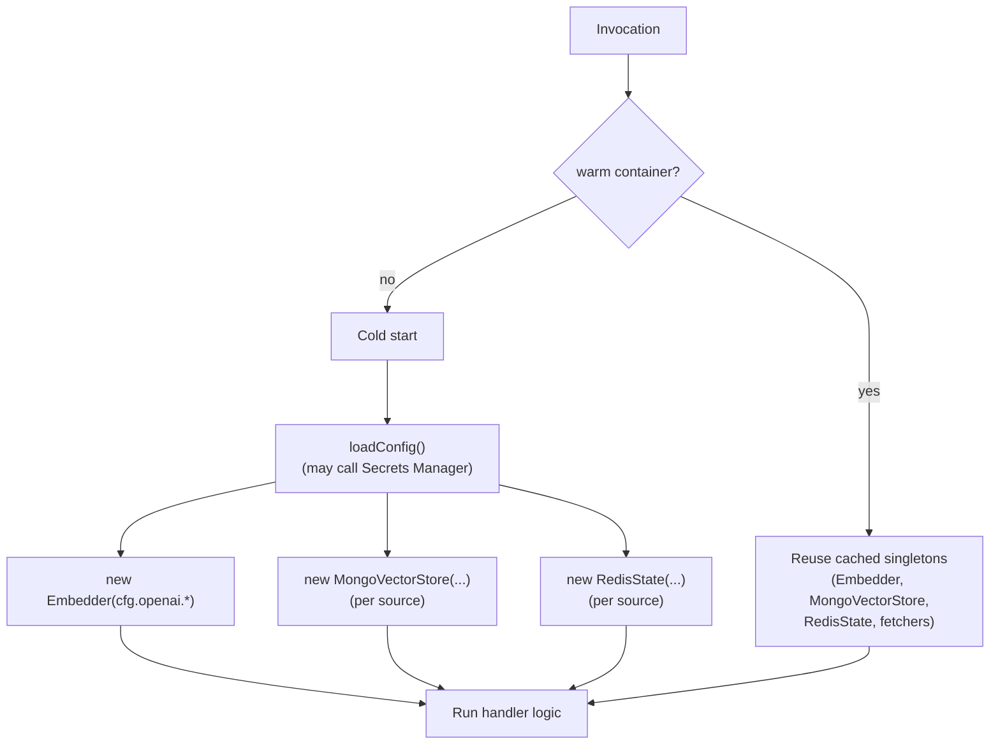

`buildIngestionDeps()` (Jira), `buildGithubIngestionDeps()` (GitHub),
and `buildRetrievalDeps()` are the three factory functions. Retrieval
returns **both** vector stores so it can answer cross-source queries.

---

## 6. Ingestion lifecycle — Jira

End-to-end flow when EventBridge or the CLI fires `mode=full | incremental`,
`source=jira`:

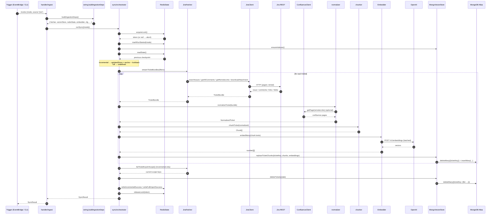

### Per-ticket "delete-then-insert" idempotency

Every ticket is processed as an **atomic replacement**: we delete every
chunk that has `ticketKey === <key>` and then insert the freshly
generated chunks. This makes ingestion **safe to re-run**, makes content
edits trivially correct (old chunks vanish), and removes the need for
content-diff logic.

---

## 7. Ingestion lifecycle — GitHub

GitHub ingestion mirrors the Jira shape but pulls **three entity
types** (commits, PRs, issues) into the same partition:

```mermaid
sequenceDiagram
    autonumber
    participant Trig as Trigger
    participant H as handler/ingest
    participant W as wiring.buildGithubIngestionDeps
    participant O as github/orchestrator
    participant R as RedisState (source=github)
    participant Br as listActiveBranches
    participant CF as CommitFetcher
    participant PF as PRFetcher
    participant IF as IssueFetcher
    participant GC as GithubClient
    participant GH as GitHub REST/GraphQL
    participant Ch as Entity chunkers
    participant E as Embedder
    participant V as MongoVectorStore (rag_chunks_github)

    Trig->>H: invoke {mode, source:"github", entityTypes?}
    H->>W: buildGithubIngestionDeps()
    W-->>H: deps
    H->>O: runGithubSync({mode, entityTypes})

    O->>R: acquireLock(); markRunStarted(mode)
    O->>R: readState(); compute since
    O->>Br: listActiveBranches(staleBranchDays, maxBranches)
    Br->>GC: branches via REST
    GC->>GH: HTTP
    GH-->>GC: branches
    GC-->>Br: filtered list
    Br-->>O: ActiveBranch[]

    par commits
        O->>CF: streamCommits(branches, since)
        CF->>GC: per-branch list + commit detail
        GC->>GH: REST
        loop each commit
            CF-->>O: NormalizedCommit
            O->>Ch: chunkCommit(commit)
            Ch-->>O: Chunk[]
            O->>E: embedMany
            O->>V: replaceEntityChunks("commit:<sha>", ...)
        end
    and pull requests
        O->>PF: streamPullRequests(since)
        PF->>GC: PR detail (+ reviews + comments)
        loop each PR
            PF-->>O: NormalizedPR
            O->>Ch: chunkPullRequest(pr)
            O->>E: embedMany
            O->>V: replaceEntityChunks("pr:<n>", ...)
        end
    and issues
        O->>IF: streamIssues(since)
        IF->>GC: issue detail (+ comments)
        loop each issue
            IF-->>O: NormalizedIssue
            O->>Ch: chunkIssue(issue)
            O->>E: embedMany
            O->>V: replaceEntityChunks("issue:<n>", ...)
        end
    end

    O->>O: deletion sweep per entity type
    O->>V: deleteEntities(stale)
    O->>R: writeGithubFullImportSuccess / writeGithubIncrementalSuccess
    O->>R: releaseLock(token)
    O-->>H: GithubSyncResult
```

GitHub-specific notes:

- **Active-branch heuristic**: GitHub does not expose a "stale" flag, so
  we treat any branch whose tip commit is newer than
  `GITHUB_STALE_BRANCH_DAYS` as active and cap iteration at
  `GITHUB_MAX_BRANCHES`.
- **Run-local SHA dedupe** prevents double-indexing a commit that exists
  on multiple active branches.
- **`entityKey` partition** (`commit:<sha>`, `pr:<n>`, `issue:<n>`) is
  the GitHub equivalent of `ticketKey`.

---

## 8. Full vs incremental sync

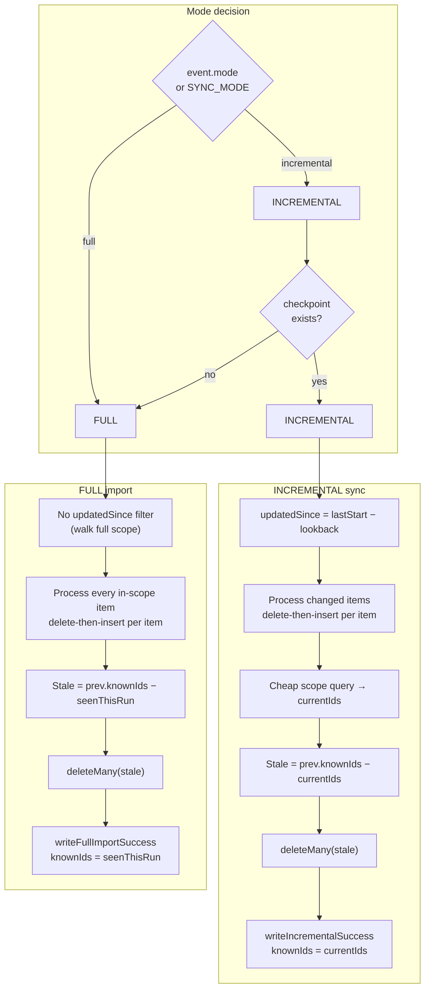

Why the **lookback window** on incremental runs?  Atlassian and GitHub
both have small update-timestamp lag, and Lambda clocks are not
perfectly synced. Subtracting `INCREMENTAL_LOOKBACK_MINUTES` (default
60) from the previous start time guarantees we never miss an edit.
Reprocessing duplicates is harmless because the per-item
delete-then-insert is idempotent.

---

## 9. Redis sync state and locking

State is stored under per-source keys to keep failure domains isolated:

```
{REDIS_KEY_PREFIX}state:jira     ← Jira checkpoint JSON
{REDIS_KEY_PREFIX}state:github   ← GitHub checkpoint JSON
{REDIS_KEY_PREFIX}lock:jira      ← Jira distributed run lock
{REDIS_KEY_PREFIX}lock:github    ← GitHub distributed run lock
```

State document (Jira variant):

```json
{
  "source": "jira",
  "lastFullImportAt":           "2026-04-21T10:00:00Z",
  "lastIncrementalStartAt":     "2026-04-21T11:00:00Z",
  "lastIncrementalCompletedAt": "2026-04-21T11:02:18Z",
  "mode":          "incremental",
  "status":        "idle",
  "failureReason": null,
  "schemaVersion": 2,
  "knownTicketKeys": ["PROJ-1", "PROJ-2", "PROJ-7"]
}
```

GitHub variant adds:

```json
{
  "knownEntityIds": {
    "commits":      ["abc123…"],
    "pullRequests": [42, 43],
    "issues":       [15, 17]
  },
  "branchCheckpoints": {
    "main":          { "lastSha": "abc…", "lastSeenAt": "..." },
    "release/1.0":   { "lastSha": "def…", "lastSeenAt": "..." }
  }
}
```

Locking and state machine:

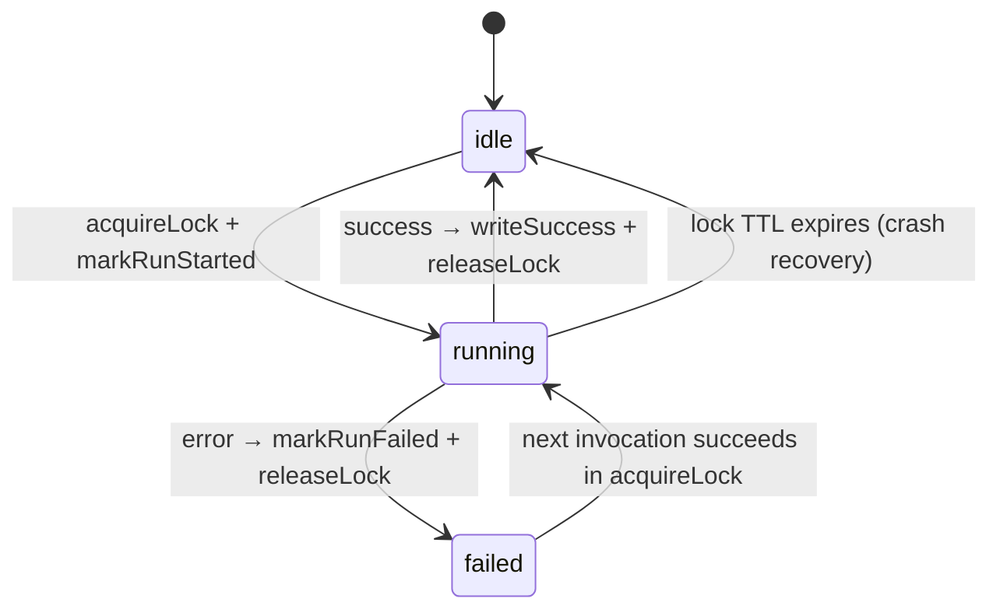

Guarantees:

- **One run at a time per source** (the lock is `SET NX EX`).
- **Crash safety**: state is only written on success, so a mid-run
  crash leaves the previous checkpoint intact and the next run retries
  the same window.
- **Self-healing**: if the lock holder crashes without releasing, the
  TTL evicts the lock so the system never wedges forever.
- **Schema versioning**: `schemaVersion` is read on every load so we can
  evolve the shape later with a migration step.

---

## 10. Chunking strategy

We deliberately avoid naive fixed-size chunking. Each source type has a
**semantic-aware chunker** that respects natural boundaries.

| Source kind                  | Chunker                                | Typical size      |
| ---------------------------- | -------------------------------------- | ----------------- |
| Jira ticket metadata         | One chunk: key + summary + labels…     | ~200 tokens       |
| Jira description             | Paragraph split + token overlap        | 300–500 tokens    |
| Jira comments                | Group of N short OR single long        | 200–400 tokens    |
| Jira linked issues           | One chunk per linked issue summary     | ~200 tokens       |
| Jira attachments             | Per-file recursive paragraph split     | 300–500 tokens    |
| Confluence pages             | Section-header-aware split             | 400–600 tokens    |
| GitHub commit message        | One chunk                               | ≤ 400 tokens      |
| GitHub commit file list      | Bundled into 1+ chunks                  | ≤ 400 tokens each |
| GitHub PR body               | Paragraph split + overlap               | 500 tokens        |
| GitHub PR reviews / comments | Grouped or single                       | 600 / 200 tokens  |
| GitHub issue body / comments | Same shape as Jira description/comments | 500 / 200 tokens  |

**Deterministic chunk IDs:**

```
sha256( partitionKey | sourceType | subIndex | contentFingerprint )
```

Why deterministic? Re-running ingestion on the same content produces the
same `_id`s, so `deleteMany({partitionField: key}) → insertMany(chunks)`
is safe even if the previous run partially completed.

---

## 11. Vector store layout (MongoDB Atlas)

Each ingestion source has its **own collection and its own Atlas Vector
Search index**. They share a database for operational simplicity, but
the partitioning means a query for one source can never accidentally
return chunks from the other.

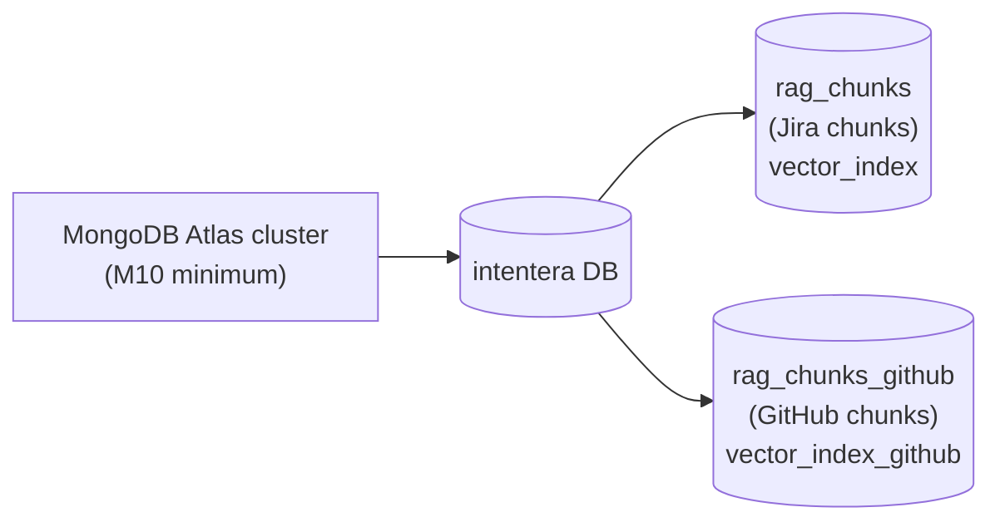

Jira chunk document:

```json
{
  "_id":         "<deterministic chunk id>",
  "ticketKey":   "PROJ-123",
  "projectKey":  "PROJ",
  "sourceType":  "description | comments | attachment | confluence | metadata | linkedIssues",
  "chunkIndex":  0,
  "text":        "...",
  "embedding":   [0.001, 0.024, ...],  // 1536 floats by default
  "metadata":    {
    "summary":   "...",
    "status":    "In Progress",
    "priority":  "High",
    "labels":    ["backend"],
    "updatedAt": "2026-04-21T10:00:00Z",
    "fileName":  null,
    "pageTitle": null
  },
  "indexedAt":   "2026-04-21T10:01:00Z"
}
```

GitHub chunk document:

```json
{
  "_id":          "<deterministic chunk id>",
  "entityKey":    "pr:42",
  "entityType":   "commit | pullRequest | issue",
  "repoFullName": "owner/name",
  "sourceType":   "metadata | body | message | files | review | conversation | comments",
  "chunkIndex":   0,
  "text":         "...",
  "embedding":    [0.001, ...],
  "metadata":     {
    "branches":    ["main"],
    "filePaths":   ["src/auth.ts"],
    "labels":      ["bug"],
    "prNumber":    42,
    "issueNumber": null,
    "commitSha":   null
  },
  "indexedAt":    "2026-04-21T10:01:00Z"
}
```

Vector index definitions live in `docs/mongodb-atlas-setup.md`. Both
indexes use **cosine similarity** and `numDimensions: 1536` to match
`text-embedding-3-small`. If you swap embedding models, **the index
must be recreated** with the new dimensionality.

---

## 12. Retrieval lifecycle

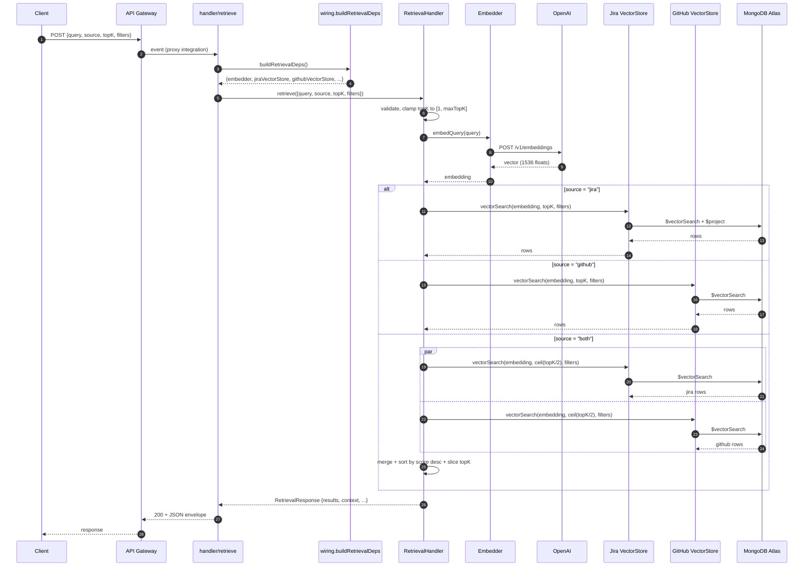

Response shape:

```json
{
  "query":       "How did we fix the SSO bug?",
  "retrievedAt": "2026-04-21T18:00:00Z",
  "source":      "both",
  "topK":        8,
  "appliedFilters": { "labels": ["auth"] },
  "results": [
    {
      "chunkId":      "...",
      "source":       "jira",
      "entityKey":    "PROJ-123",
      "entityType":   null,
      "projectKey":   "PROJ",
      "repoFullName": null,
      "sourceType":   "description",
      "score":        0.881,
      "text":         "...",
      "metadata":     { "...": "..." }
    },
    { "source": "github", "...": "..." }
  ],
  "context": "--- [1] jira:PROJ-123 (description) score=0.881 ---\n..."
}
```

Notes:

- The handler accepts both **API Gateway proxy** events (body is a
  string) and **direct invokes** (body is the event itself).
- `topK` is **clamped** to the configured `[1, RETRIEVAL_MAX_TOP_K]`
  range.
- Filters with empty / null values are **dropped** before they hit
  Mongo so we never accidentally filter on `undefined`.
- Errors are categorised: validation/business errors return **400**;
  everything else returns **500** with a generic message (no stack
  leaks).

---

## 13. Failure handling and retries

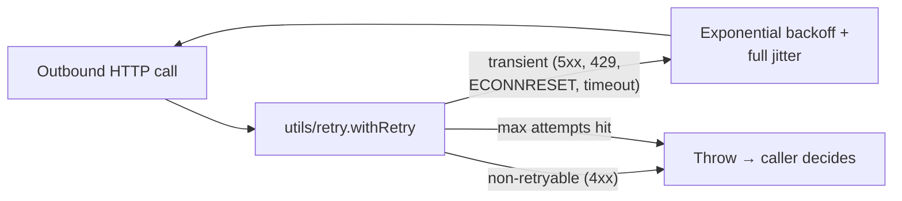

Retry behaviour:

- **Embedder**, **JiraClient**, **ConfluenceClient**, **GithubClient**,
  and **MongoVectorStore.connect** all wrap their network calls in
  `withRetry`.
- Authentication errors (`401`, `403`) and "permanent" failures (`410`,
  `404` on a critical endpoint) are **not** retried — they almost
  always indicate config drift, not transient noise.

Per-item resilience inside the orchestrators:

- A **single ticket / commit / PR / issue failure is logged and
  skipped**; the run continues. The next incremental run will pick the
  failed item up again because its `updated`/`since` timestamp is still
  newer than the (unchanged) checkpoint.
- A **stream-level failure** (e.g. Jira returns 500 mid-pagination)
  bubbles up, `markRunFailed` is called, and the lock is released. The
  checkpoint is not advanced.

Lambda-level:

- The handler **lets exceptions propagate** so Lambda marks the
  invocation as failed. EventBridge will retry per the rule's retry
  policy.

---

## 14. AWS deployment topology

A production deployment looks like this:

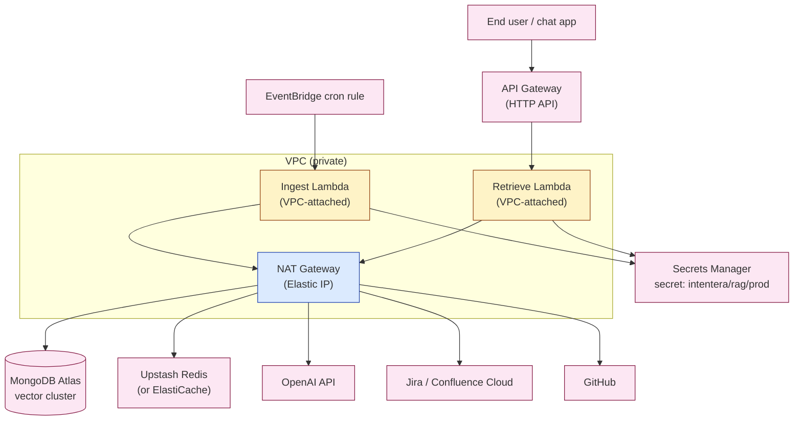

Why the **NAT Gateway with Elastic IP**?  MongoDB Atlas requires IP
allowlisting (or PrivateLink). Lambda's outbound IP is non-deterministic
*unless* you put it in a VPC and route egress through a NAT Gateway —
then the NAT's Elastic IP is the single value you whitelist in Atlas.

Operational sizing tips:

- **Ingest Lambda**: 1024 MB, 5–15 minute timeout, reserved concurrency = 1
  (Redis lock makes 1 the safe ceiling per source anyway).
- **Retrieve Lambda**: 512 MB, 30 s timeout, concurrency = whatever your
  traffic needs.
- **Cold start dominated by Mongo + Redis connect** — keep the Lambdas
  warm if latency matters.

---

## 15. Local development flow

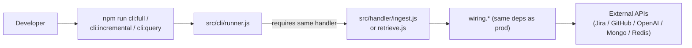

The CLI calls the **exact same handler functions** that Lambda
executes; the only difference is that `dotenv` populates `process.env`
from a local `.env` file and the runner tears down the Mongo/Redis
clients at the end so Node can exit cleanly.

Common commands:

```bash
npm run cli:full                          # forced full Jira import
npm run cli:incremental                   # incremental Jira sync
npm run cli:query -- "How was SSO fixed?"
node src/cli/runner.js full --source github
node src/cli/runner.js state --source jira
```

`--no-deprecation` is passed in the npm scripts to silence a harmless
upstream `punycode` deprecation warning emitted by the Mongo driver's
URL parser.

---

## 16. Tradeoffs and future work

| Area                       | Today                                                      | Future                                                          |
| -------------------------- | ---------------------------------------------------------- | --------------------------------------------------------------- |
| Per-ticket concurrency     | Sequential inside one Lambda invocation                    | Fan-out via SQS + per-item Lambda for very large orgs           |
| Embeddings                 | OpenAI `text-embedding-3-small` (1536d, cheap)             | Pluggable: `text-embedding-3-large`, Cohere, local model        |
| Vector store               | Atlas Vector Search (M10+ required)                        | Could swap to Pinecone, OpenSearch, or pgvector                 |
| Cross-source ranking       | Score-sorted concatenation                                  | True hybrid rerank (BM25 + vector) or a small reranker model    |
| Distributed lock           | Single SET NX EX                                            | Redlock when running multiple cluster regions                   |
| Confluence fetching        | Live per-run (no cache)                                     | TTL cache to reduce duplicate hits inside a single run          |
| Comment-level diffing      | Jira: parent ticket `updated` triggers re-index             | Per-comment hashing in Redis to skip unchanged comments         |
| GitHub branch coverage     | Heuristic "active" via tip-commit age                       | Honor configurable `branchPatterns` regex list                  |
| Retrieval reranking        | None                                                        | Optional cross-encoder rerank pass on the top-N before truncation |
| Observability              | Structured logs only                                        | OpenTelemetry traces + CloudWatch metrics dashboards            |

---

## Appendix A — Key environment variables

These are the most important; full reference lives in
`docs/configuration-reference.md`.

| Variable                          | Purpose                                                |
| --------------------------------- | ------------------------------------------------------ |
| `SYNC_MODE`                       | Default ingestion mode (`incremental` / `full`)        |
| `SYNC_SOURCE`                     | Default ingestion source (`jira` / `github`)           |
| `INCREMENTAL_LOOKBACK_MINUTES`    | Backwards window applied to every incremental run     |
| `JIRA_*` / `CONFLUENCE_*`         | Atlassian credentials, scope filters, toggles          |
| `GITHUB_*`                        | PAT, repo, entity-type toggles, branch heuristics      |
| `MONGODB_*`                       | URI, DB, collection + vector index per source          |
| `REDIS_URL` / `REDIS_KEY_PREFIX`  | Sync state + lock storage                              |
| `OPENAI_*`                        | Embedding model, dimensions, batch size                |
| `USE_SECRETS_MANAGER`             | Toggle Secrets Manager loader (vs `.env`)              |
| `RETRIEVAL_DEFAULT_TOP_K`         | Default `topK` if the request does not specify one     |
| `RETRIEVAL_MAX_TOP_K`             | Hard upper bound for `topK`                            |

---

## Appendix B — Useful entry points when reading the code

- Ingestion entry point → `src/handler/ingest.js`
- Retrieval entry point → `src/handler/retrieve.js`
- Jira orchestration → `src/sync/orchestrator.js`
- GitHub orchestration → `src/github/orchestrator.js`
- Sync state and lock → `src/state/redisState.js`
- Vector store I/O → `src/vectorStore/mongoStore.js`
- Retrieval logic → `src/retrieval/queryHandler.js`
- Dependency wiring → `src/utils/wiring.js`
- Config validation → `config/appConfig.js`
- Secrets loading → `config/secrets.js`
