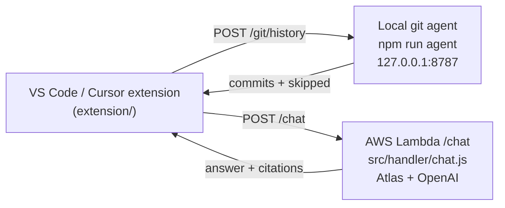

# Running the Chat Feature (Three-Step Runbook)

This is the action-oriented "how do I turn on the chat feature?" guide. It
assumes you have already finished [getting-started.md](getting-started.md)
and have a working IntentEra ingestion + retrieval pipeline. For the
architecture, wire formats, and privacy notes, read
[code-chat.md](code-chat.md). For the IDE-side install detail, read
[../extension/README.md](../extension/README.md).

---

## What you'll end up with

- A sidebar panel titled **IntentEra Chat** in VS Code or Cursor.
- Two right-click commands: **IntentEra: Ask about selection** and
  **IntentEra: Ask about this file**.
- Grounded answers with three citation lists (commits, Jira tickets, PRs)
  for any file or selection in your project.

---

## Three pieces



Each piece is independent:

- The **chat Lambda** does multi-query RAG against your existing Mongo
  Atlas collections and asks OpenAI to compose a grounded answer.
- The **local git agent** is a tiny Node/Express server that binds to
  loopback and shells out to `git log` against your working tree. It is
  the only piece that touches your filesystem; it has zero outbound
  network calls.
- The **extension** is a standard VSIX that runs in both VS Code and
  Cursor.

---

## Prerequisites

- An IntentEra deployment whose ingestion has populated either the Jira
  or GitHub vector collection (or both). If neither is populated, the
  chat answer degrades to "based only on the question and any attached
  file content".
- An OpenAI API key reachable from the chat Lambda.
- Node.js 18+ installed locally for the git agent and the extension
  build.
- VS Code or Cursor for installing the extension.

---

## Step 1 — Deploy the chat Lambda

The handler lives at `src/handler/chat.handler` and ships in the same
deployment artifact as the ingest and retrieve Lambdas. Wire it to API
Gateway as `POST /chat`.

> **Need step-by-step instructions?** If this is your first time
> deploying a Lambda for this project, follow the beginner-friendly,
> click-by-click guide in
> [deploy-chat-lambda.md](deploy-chat-lambda.md) and then come back
> here for Steps 2 and 3. The summary below assumes you've deployed
> Lambdas before.

Recommended Lambda settings:

- Memory: 1024 MB
- Timeout: 30–60 seconds
- Trigger: API Gateway HTTP API `POST /chat`

The chat handler reuses every existing variable (`MONGODB_URI`,
`OPENAI_API_KEY`, `JIRA_ENABLED`, `GITHUB_ENABLED`, vector index names,
etc.) plus four new ones. All four have safe defaults; set them only if
you want to override the defaults.

| Variable | Default | What it tunes |
|---|---|---|
| `OPENAI_CHAT_MODEL` | `gpt-4o-mini` | Chat completion model. Must support `response_format=json_object`. |
| `CHAT_PER_VECTOR_TOP_K` | `3` | Per-query topK in the multi-query RAG fan-out. |
| `CHAT_MERGED_TOP_N` | `12` | Cap on the merged, de-duplicated hit list passed to the LLM. |
| `CHAT_MAX_LOCAL_COMMITS` | `50` | Defensive cap on commits accepted per request. |

Full descriptions live in
[configuration-reference.md](configuration-reference.md#chat-feature-extension--lambda-chat).

If only one of `JIRA_ENABLED` / `GITHUB_ENABLED` is true, only that leg
of RAG runs. The handler degrades gracefully.

The full wire format is documented in
[code-chat.md](code-chat.md#wire-formats).

---

## Step 2 — Run the local git agent

In a clone of the IntentEra repo on the developer's machine (NOT inside
`extension/`), once per machine session:

```bash
npm install   # only on first run
npm run agent
# IntentEra local git agent ready at http://127.0.0.1:8787
```

Verify it's healthy:

```bash
curl http://127.0.0.1:8787/healthz
# {"ok":true,...}
```

The agent:

- Binds to **127.0.0.1 only** (loopback). Not reachable off-host.
- Requires `projectPath` on each request to be **absolute** and to
  contain a `.git/` directory.
- Optionally enforces an allowlist via `AGENT_ALLOWED_PROJECT_ROOTS`
  (comma-separated absolute path prefixes). Empty = any `.git` repo on
  the machine is acceptable.
- Has **zero outbound dependencies** — no Mongo, no OpenAI, no network
  egress. It only shells out to `git`.

Optional env vars (leave unset for sensible defaults):

| Variable | Default | Notes |
|---|---|---|
| `AGENT_PORT` | `8787` | Port the agent listens on. If you change this, also update `intentera.agentUrl` in your IDE settings. |
| `AGENT_ALLOWED_PROJECT_ROOTS` | *(empty)* | Comma-separated absolute path prefixes. Treat as a safety allowlist. |

The `agent:dev` script in [package.json](../package.json) is identical
to `agent` but pins `AGENT_PORT=8787` for convenience.

---

## Step 3 — Install and configure the extension

From the [extension/](../extension/) folder:

### Option A — packaged VSIX

```bash
cd extension
npm install
npm run build
npx @vscode/vsce package
code --install-extension intentera-chat-0.1.0.vsix
# Cursor uses the same CLI shape:
# cursor --install-extension intentera-chat-0.1.0.vsix
```

### Option B — Extension Development Host

```bash
cd extension
npm install
npm run build
# Open the extension/ folder in VS Code or Cursor and press F5.
```

Then in IDE settings (`Preferences › Settings › IntentEra`):

| Setting | Required | Default | Description |
|---|---|---|---|
| `intentera.lambdaChatUrl` | yes | `""` | Your API Gateway URL for the IntentEra `/chat` endpoint. |
| `intentera.lambdaApiKey` | no | `""` | Sent as `x-api-key` if your endpoint requires it. |
| `intentera.agentUrl` | no | `http://127.0.0.1:8787` | Where the local git agent listens. Match this to your `AGENT_PORT`. |
| `intentera.maxLocalCommits` | no | `50` | Cap on commits the agent extracts per request. |
| `intentera.requestTimeoutMs` | no | `60000` | Lambda call timeout in ms. |

See [../extension/README.md](../extension/README.md) for screenshots and
the full settings table.

---

## Smoke test

With all three pieces running:

1. Open any file inside a git-tracked project in VS Code or Cursor.
2. Right-click in the editor → **IntentEra: Ask about this file**.
   A context chip appears in the chat panel.
3. Type a question (e.g. "Why does this module exist?") and press
   **Send** or `Cmd/Ctrl-Enter`.
4. Within ~5–30 seconds you should see:
   - A plain-English answer paragraph.
   - **Commits that shaped this** with short SHAs and subjects.
   - **Linked Jira tickets** (if Jira ingestion is on and matches exist).
   - **Related GitHub PRs** (if GitHub ingestion is on and matches exist).

If the panel shows a yellow status banner instead, it tells you exactly
which piece is missing:

| Banner says | Fix |
|---|---|
| Lambda URL not set | Fill in `intentera.lambdaChatUrl` in IDE settings. |
| Local agent unreachable | Run `npm run agent` in the IntentEra repo, check `AGENT_PORT` matches `intentera.agentUrl`. |
| Lambda returned non-2xx | Check CloudWatch logs for the chat Lambda. |

---

## Troubleshooting

- **Empty `commits` array on every answer.** The local agent isn't
  running or `intentera.agentUrl` is wrong. The Lambda still answers,
  but the answer falls back to "based only on the question and any
  attached file content".
- **`projectPath must be absolute` errors.** The extension always sends
  the absolute workspace path; if you're hitting the agent directly with
  `curl`, pass an absolute path that contains a `.git/` dir.
- **`projectPath not in AGENT_ALLOWED_PROJECT_ROOTS`.** Either add the
  project's parent to `AGENT_ALLOWED_PROJECT_ROOTS` or unset that
  variable.
- **Citations look unrelated.** Lower `CHAT_PER_VECTOR_TOP_K` or
  `CHAT_MERGED_TOP_N` to keep the LLM's context tighter, or check that
  the relevant Jira/GitHub data is actually ingested.
- **General errors.** Check
  [debugging-and-troubleshooting.md](debugging-and-troubleshooting.md)
  by exact error text.

For the privacy / data-flow contract (what leaves your machine, what
goes to OpenAI), read
[code-chat.md](code-chat.md#privacy--data-flow).

---

## What this runbook does NOT cover

- Architecture and wire formats — see [code-chat.md](code-chat.md).
- IDE-side install detail and screenshots — see
  [../extension/README.md](../extension/README.md).
- General Lambda packaging — see [aws-deployment.md](aws-deployment.md).
- Atlas index setup — see
  [mongodb-atlas-setup.md](mongodb-atlas-setup.md).
