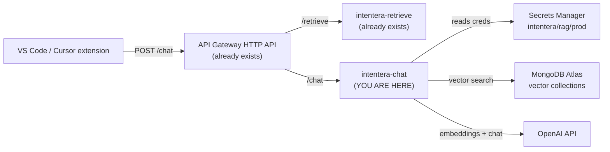

# Deploying the Chat Lambda — Beginner Walkthrough

This is a **step-by-step, click-by-click** guide for deploying the new
`/chat` endpoint to AWS, written for someone who has **never deployed a
Lambda before** but already has the ingest + retrieve Lambdas running
(by following [aws-deployment.md](aws-deployment.md)).

If any term is unfamiliar, there is a one-line "what this is" beside it.
Don't skip those.

> **Time:** 20–30 minutes the first time.
> **Cost:** essentially zero — the same penny-per-thousand-invocations
> bracket as the other two Lambdas.

---

## Before you start: what you should already have

You should already be in this state from earlier deployment work:

- A Lambda called `intentera-ingest` running and producing data. *(Lambda
  = a piece of code AWS runs for you on demand; you don't manage a
  server.)*
- A Lambda called `intentera-retrieve` running behind an **API Gateway**
  HTTP API. *(API Gateway = AWS's HTTPS front-door for Lambdas.)*
- A **Secrets Manager** secret called something like
  `intentera/rag/prod` that holds your `OPENAI_API_KEY`, `MONGODB_URI`,
  Jira/GitHub tokens, etc. *(Secrets Manager = AWS's encrypted key-value
  store for credentials.)*
- An **execution role** attached to the existing Lambdas that has
  permission to read that secret. *(Execution role = an AWS identity
  the Lambda assumes while it runs.)*

If any of those is missing, finish [aws-deployment.md](aws-deployment.md)
first and come back here.

---

## What you are about to build

Three small things on top of what you already have:

1. A **third Lambda** called `intentera-chat` that runs the chat handler
   (`src/handler/chat.handler`). It uses the **same zip** and the
   **same secret** as the other two.
2. A **new route** `POST /chat` on your existing API Gateway, pointing
   at that Lambda. So your final URLs become:
   - `POST https://abc123.execute-api.<region>.amazonaws.com/retrieve`
     *(already there)*
   - `POST https://abc123.execute-api.<region>.amazonaws.com/chat`
     *(new)*
3. *(Optional)* one new key inside your Secrets Manager secret called
   `OPENAI_CHAT_MODEL`. You only add this if you want a non-default
   chat model.

That's it. No new VPC. No new Atlas index. No new Redis. No new role
*(if you reuse the existing one)*.



---

## Step 1 — (Re)build the deployment zip

The chat handler ships in the **same `intentera.zip`** as ingest and
retrieve. If you already have a recent `intentera.zip` from earlier
deployment work, you can skip this step.

Otherwise, from the project root:

```bash
# 1. Clean install of production-only dependencies
rm -rf node_modules
npm install --omit=dev

# 2. Bundle the code Lambda needs to run
zip -r intentera.zip config src node_modules package.json

# 3. Sanity check the size
ls -lh intentera.zip
```

You should see a file around **20–30 MB**. AWS Lambda accepts direct
zip uploads up to 50 MB, so we're fine.

> **Why these folders only?** `config/` holds env loaders, `src/` is the
> code, `node_modules/` are the runtime libs, `package.json` tells Node
> what's where. Everything else (docs, examples, tests) is not needed
> at runtime.

---

## Step 2 — Add the chat-model key to your secret (optional)

The chat Lambda has one new secret-style variable:

| Key | Default | Notes |
|---|---|---|
| `OPENAI_CHAT_MODEL` | `gpt-4o-mini` | The OpenAI chat model used to compose answers. Must support `response_format=json_object`. |

**You can skip this step entirely** and accept the default
`gpt-4o-mini`. Only do it if you want a different model.

If you do want to override it:

1. AWS Console → search "Secrets Manager" → open your secret (e.g.
   `intentera/rag/prod`).
2. **Retrieve secret value** → **Edit**.
3. Add a row: key `OPENAI_CHAT_MODEL`, value e.g. `gpt-4o`.
4. **Save**.

You don't need to redeploy any Lambda — they'll pick up the new value on
their next cold start (within ~15 minutes, or you can force it by
clicking **Deploy** / saving config in the Lambda).

> **Why is this in Secrets Manager and not as a plain Lambda env var?**
> It doesn't have to be. Putting it in the secret keeps **all** chat
> config in one place. If you'd rather set it as a plain Lambda env var
> (Step 3 below), that works just as well.

---

## Step 3 — Create the chat Lambda

This is the bulk of the work. We do it in the AWS Console because that
is the most beginner-friendly path. The CLI version is in the box at
the end of this doc.

### 3.1 — Open the Lambda console

AWS Console → search **"Lambda"** → click **Lambda** → **Functions** in
the left sidebar.

You should already see `intentera-ingest` and `intentera-retrieve` in
the list. We are adding a third one.

### 3.2 — Create the function

Click the orange **Create function** button (top right).

| Field | What to choose | Why |
|---|---|---|
| Author from scratch | (selected by default) | We are not using a blueprint or container. |
| Function name | `intentera-chat` | Convention. Lowercase + dashes, like the others. |
| Runtime | **Node.js 20.x** *(or whatever your other two Lambdas use)* | Match the others to avoid surprises. |
| Architecture | `x86_64` *(or `arm64` — match the others)* | Same reason. |

Then expand **"Change default execution role"**:

- Choose **Use an existing role**.
- In the dropdown, **pick the same role used by `intentera-retrieve`**.
  *(Easiest way to find it: open `intentera-retrieve` in another tab,
  go to **Configuration → Permissions**, copy the role name.)*

> **Why reuse the role?** The retrieve Lambda already has permission to
> read your Secrets Manager secret. Reusing it means we don't have to
> re-attach the policy. If you'd rather create a fresh role, see the
> "Alternative: brand-new role" box at the end of Step 3.

Click **Create function** at the bottom right. Wait ~10 seconds. You
should land on the new function's overview page.

### 3.3 — Upload the code

You're on the new function's page. Scroll to the **Code source** panel.

1. Top-right of that panel → **Upload from** → **.zip file**.
2. Browse to your `intentera.zip` from Step 1 → **Save**.
3. AWS shows "Successfully updated the function intentera-chat."

### 3.4 — Tell Lambda which function to call (the "handler")

By default, AWS expects `index.handler`. Our handler lives elsewhere.

1. Scroll down to **Runtime settings** → **Edit**.
2. **Handler:** change to exactly `src/handler/chat.handler`. *(That
   means: file `src/handler/chat.js`, exported function `handler`.)*
3. **Save**.

> **If you typo this**, the Lambda invocation will fail with
> `Runtime.HandlerNotFound`. The fix is to come back here and correct
> the value.

### 3.5 — Configure memory and timeout

The defaults are too small for chat (it does multi-query embedding +
RAG + a chat completion in one request).

1. **Configuration** tab → **General configuration** → **Edit**.
2. **Memory:** `1024` MB.
3. **Timeout:** `1` min `0` sec.
4. **Ephemeral storage:** leave at `512` MB.
5. **Save**.

> **Why 1 GB and 60 s?** A typical chat call is 5–15 seconds; 60 s gives
> headroom for the cold-start case where the Lambda also has to load
> Secrets Manager and open a Mongo connection. 1 GB of memory is enough
> for the embedding + chat workload comfortably.

### 3.6 — Set environment variables

Lambda needs to know which secret to load.

1. **Configuration** → **Environment variables** → **Edit** →
   **Add environment variable**.
2. Add these three (exactly as shown):

| Key | Value |
|---|---|
| `USE_SECRETS_MANAGER` | `true` |
| `SECRETS_MANAGER_SECRET_ID` | `intentera/rag/prod` *(or whatever your secret is named)* |
| `LOG_LEVEL` | `info` *(use `debug` while you're bringing this up; switch to `info` later)* |

3. **Save**.

These three are the same three on `intentera-retrieve`. Open it in a
second tab to copy them if you want to be sure.

#### Optional tuning variables

You can stop here. Only add the ones below if you want to change
defaults. Full descriptions in
[configuration-reference.md](configuration-reference.md#chat-feature-extension--lambda-chat).

| Key | Default | When to override |
|---|---|---|
| `CHAT_PER_VECTOR_TOP_K` | `3` | Lower for cheaper / tighter context. |
| `CHAT_MERGED_TOP_N` | `12` | Lower if the LLM context is too noisy. |
| `CHAT_MAX_LOCAL_COMMITS` | `50` | Lower if extension users are sending huge histories. |
| `OPENAI_CHAT_MODEL` | `gpt-4o-mini` | Override here instead of in Secrets Manager. |

### 3.7 — Smoke-test the Lambda directly

Before plugging it into API Gateway, confirm it boots and answers.

1. **Test** tab → **Create new test event**.
2. **Event name:** `smoke`.
3. **Event JSON:** paste this exactly:

   ```json
   {
     "body": "{\"question\":\"Why does this module exist?\",\"commits\":[],\"attachments\":[]}"
   }
   ```

4. Click **Save**, then **Test**.

You should see a green **Execution result: succeeded** banner. Click
**Details** to expand the response. The body field should be a JSON
string starting with `"answer":"...` and containing a `"citations"`
block. Empty `commits` is fine — that just means "no local git
context"; the answer comes from Jira/GitHub RAG only.

If you see an error:

| Symptom | Likely cause | Fix |
|---|---|---|
| `Runtime.HandlerNotFound` | Handler typo in step 3.4. | Re-edit to `src/handler/chat.handler`. |
| `AccessDeniedException` on `secretsmanager:GetSecretValue` | Execution role can't read the secret. | Re-attach the policy from [secrets-manager-setup.md §6](secrets-manager-setup.md#6-grant-the-lambda-permission-to-read-the-secret). |
| `Task timed out after 3.00 seconds` | You forgot to bump the timeout. | Step 3.5 — set timeout to 60 s. |
| `MongoServerSelectionError` | Atlas isn't reachable from Lambda. | Make sure Atlas Network Access allows `0.0.0.0/0` (or the Lambda's NAT IPs). |

When the smoke test passes, you have a working chat Lambda. Now expose
it.

> **Alternative: brand-new role.** If in step 3.2 you chose to create a
> new role instead of reusing the retrieve role, you must now follow
> [secrets-manager-setup.md §6](secrets-manager-setup.md#6-grant-the-lambda-permission-to-read-the-secret)
> to attach the same `secretsmanager:GetSecretValue` policy to the
> brand-new role. The smoke test will fail with `AccessDeniedException`
> until you do.

---

## Step 4 — Add `/chat` to your existing API Gateway

You already have an HTTP API in front of `intentera-retrieve`. We're
adding a **second route** to the same API. This is cleaner than making
a brand-new API.

### 4.1 — Open the API

AWS Console → search **"API Gateway"** → open your existing API (the
one you created in [aws-deployment.md §5](aws-deployment.md#5-expose-retrieval-through-api-gateway),
typically named `intentera-retrieve-api`).

### 4.2 — Create the route

1. Left sidebar → **Routes** → **Create**.
2. **Method:** `POST`.
3. **Path:** `/chat`.
4. Click **Create**.

You'll see the new `POST /chat` row in the list, with **No integration
attached** in red. Fix that next.

### 4.3 — Attach the chat Lambda to the route

1. Click the new `POST /chat` route.
2. Click **Attach integration** → **Create and attach an integration**.
3. **Integration type:** `Lambda function`.
4. **Lambda function:** start typing `intentera-chat` and pick it.
5. Leave **Payload format version** at `2.0` (default).
6. Tick **Grant API Gateway permission to invoke your Lambda function**
   if it's offered. (If not, AWS will do it automatically.)
7. Click **Create**.

### 4.4 — Auto-deploy is on by default

HTTP APIs auto-deploy to the `$default` stage. There is no extra
"deploy" button to click.

To confirm, left sidebar → **Stages** → `$default` → **Auto-deploy**
should say **Enabled**. If for some reason it doesn't, click **Deploy**
manually.

### 4.5 — Note the Invoke URL

Left sidebar → **Stages** → click `$default` → copy the **Invoke URL**.
It looks like:

```
https://abc123.execute-api.<region>.amazonaws.com
```

Your two endpoints are now:

```
POST https://abc123.execute-api.<region>.amazonaws.com/retrieve   (already worked)
POST https://abc123.execute-api.<region>.amazonaws.com/chat       (new)
```

---

## Step 5 — Test the live endpoint

From any terminal:

```bash
curl -X POST "https://abc123.execute-api.<region>.amazonaws.com/chat" \
  -H "Content-Type: application/json" \
  -d '{
    "question": "Why does the auth module retry on 401?",
    "commits": [],
    "attachments": [
      { "file": "src/server/auth.ts", "range": [42, 80], "content": "// snippet" }
    ]
  }'
```

You should get a JSON response like:

```json
{
  "answer": "In plain English: ...",
  "citations": {
    "commits": [],
    "tickets": [ /* matching Jira hits if any */ ],
    "prs":     [ /* matching GitHub PR hits if any */ ]
  },
  "retrieved": { "jiraCount": 5, "githubCount": 4, "localCommitCount": 0, "mergedCount": 8 },
  "usage":     { "embeddingTokens": 0, "promptTokens": 1234, "completionTokens": 312 }
}
```

The full wire format lives in
[code-chat.md §Wire formats](code-chat.md#wire-formats).

If `curl` fails:

| Symptom | Cause | Fix |
|---|---|---|
| `{"message":"Not Found"}` | Path is wrong (note `/chat`, not `/Chat`). | Use exactly `/chat`. |
| `{"message":"Forbidden"}` | The route exists but the integration isn't attached. | Re-do step 4.3. |
| 5xx with no body | Look at CloudWatch logs for `intentera-chat`. | Usually a timeout or Atlas connection issue. |

---

## Step 6 — Lock the endpoint down (recommended before sharing)

Out of the box, anyone with the URL can call it. Pick **at least one**
of:

- **API key** *(simplest)* — API Gateway → **API keys** → **Create**.
  Then on the `/chat` route → **Authorization** → require the API key
  header. The extension already sends it as `x-api-key` if you populate
  `intentera.lambdaApiKey` in IDE settings.
- **IAM auth** — set the route authorizer to `AWS_IAM`. Clients must
  sign requests with SigV4. Heavyweight.
- **Lambda authorizer** — for OAuth/Cognito. Heaviest.

For internal team use, the API key path is the right balance.

---

## Step 7 — Point the extension at the new endpoint

Tell every developer to:

1. Open VS Code or Cursor settings → search **IntentEra**.
2. Set:
   - `intentera.lambdaChatUrl` = `https://abc123.execute-api.<region>.amazonaws.com/chat`
   - `intentera.lambdaApiKey` = the key you created in Step 6 *(if any)*

Then they can run **IntentEra: Ask about this file** and watch the chat
panel light up. End-to-end smoke-test checklist lives in
[code-chat-runbook.md §Smoke test](code-chat-runbook.md#smoke-test).

---

## Updating the chat Lambda later

When you change source code in this repo and want to push it live, the
flow is the same as for the other Lambdas. Push the **same zip** to all
three so they stay in sync:

```bash
rm -rf node_modules && npm install --omit=dev
zip -r intentera.zip config src node_modules package.json

for fn in intentera-ingest intentera-retrieve intentera-chat; do
  aws lambda update-function-code \
    --function-name "$fn" \
    --zip-file fileb://intentera.zip
done
```

If you ever change the handler path (you won't, normally):

```bash
aws lambda update-function-configuration \
  --function-name intentera-chat \
  --handler src/handler/chat.handler
```

---

## Common gotchas (read this before opening a support ticket)

1. **"My answer is empty / very generic."** Probably the Mongo
   collections aren't populated for the data you're asking about. Run
   `node src/cli/runner.js incremental --source jira` (and the GitHub
   one) and try again.
2. **"It works in `curl` but not from the extension."** Almost always
   the wrong `intentera.lambdaChatUrl` or a missing `intentera.lambdaApiKey`.
   Open the extension's webview developer tools (`Cmd+Shift+I` while
   the chat panel is focused) — the network tab tells you.
3. **"AccessDenied on Secrets Manager during the very first invocation
   each cold start, then it works."** That's not a thing. If you see
   that, you actually have an intermittent network issue or you have
   a per-invoke role that differs from cold-start; double-check your
   execution role assignment.
4. **Cost panic.** With default knobs, each chat call costs roughly:
   embedding (`(1 + commitCount)` short queries × ~$0.00002) + chat
   completion (~$0.0005 with `gpt-4o-mini`). 1000 chat calls/day is
   well under a dollar.
5. **VPC.** If your Atlas + Redis are public (recommended for free-tier
   setups), don't put the Lambda in a VPC. If they're private, follow
   the VPC notes in [aws-deployment.md §7](aws-deployment.md#7-networking-notes---todo).

---

## Bonus: the same thing as a CLI script

If you'd rather skip the Console clicks, this is the equivalent
sequence using the AWS CLI (assumes your `aarya` profile is configured
and `intentera.zip` is built):

```bash
export AWS_PROFILE=aarya
export AWS_REGION=ap-south-1
ACCOUNT_ID=$(aws sts get-caller-identity --query Account --output text)

# 1. Find the role used by intentera-retrieve and reuse it.
ROLE_ARN=$(aws lambda get-function-configuration \
  --function-name intentera-retrieve \
  --query 'Role' --output text)

# 2. Create the chat Lambda.
aws lambda create-function \
  --function-name intentera-chat \
  --runtime nodejs20.x \
  --role "$ROLE_ARN" \
  --handler src/handler/chat.handler \
  --timeout 60 \
  --memory-size 1024 \
  --zip-file fileb://intentera.zip \
  --environment "Variables={USE_SECRETS_MANAGER=true,SECRETS_MANAGER_SECRET_ID=intentera/rag/prod,LOG_LEVEL=info}"

# 3. Find your existing HTTP API id.
API_ID=$(aws apigatewayv2 get-apis \
  --query "Items[?Name=='intentera-retrieve-api'].ApiId | [0]" --output text)

# 4. Create the integration.
INTEGRATION_ID=$(aws apigatewayv2 create-integration \
  --api-id "$API_ID" \
  --integration-type AWS_PROXY \
  --integration-uri "arn:aws:lambda:$AWS_REGION:$ACCOUNT_ID:function:intentera-chat" \
  --payload-format-version 2.0 \
  --query 'IntegrationId' --output text)

# 5. Create the route.
aws apigatewayv2 create-route \
  --api-id "$API_ID" \
  --route-key 'POST /chat' \
  --target "integrations/$INTEGRATION_ID"

# 6. Allow API Gateway to invoke the Lambda.
aws lambda add-permission \
  --function-name intentera-chat \
  --statement-id apigw-chat \
  --action lambda:InvokeFunction \
  --principal apigateway.amazonaws.com \
  --source-arn "arn:aws:execute-api:$AWS_REGION:$ACCOUNT_ID:$API_ID/*/*/chat"

# 7. Smoke test.
INVOKE_URL=$(aws apigatewayv2 get-api --api-id "$API_ID" \
  --query 'ApiEndpoint' --output text)

curl -X POST "$INVOKE_URL/chat" \
  -H "Content-Type: application/json" \
  -d '{"question":"smoke test","commits":[],"attachments":[]}'
```

---

## What's next

- Run through the
  [code-chat-runbook.md](code-chat-runbook.md) end-to-end smoke test
  with the local agent + extension.
- Read [code-chat.md](code-chat.md) for the deeper architecture and the
  privacy / data-flow contract.
- Tune costs: see the variables in
  [configuration-reference.md §Chat feature](configuration-reference.md#chat-feature-extension--lambda-chat).
